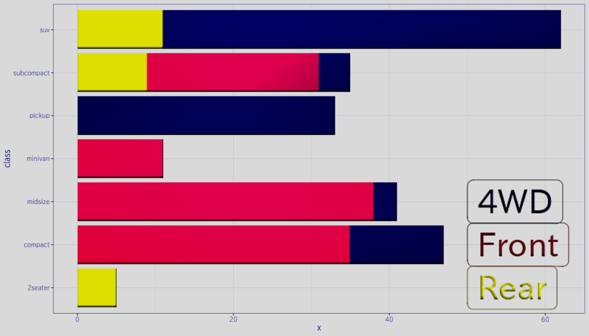
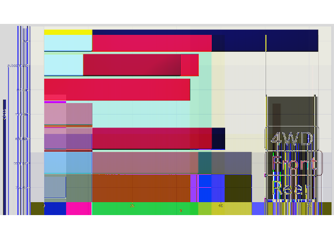

<!-- README.md is generated from README.Rmd. Please edit that file -->

# pnglitchr

<!-- badges: start -->

[](https://lifecycle.r-lib.org/articles/stages.html#experimental)
<!-- badges: end -->

pnglitchr is an R package that offers a thin wrapper around
[chikoski/png-glitch](https://github.com/chikoski/png-glitch), a library
to glitch PNG images.

## Installation

To install this package, the Rust toolchain is required.

``` r
remotes::install_github("paithiov909/pnglitchr")
```

## Examples

The following code shows how to glitch an image. The original image
looks like this:

<figure>

<figcaption aria-hidden="true">Original image</figcaption>
</figure>

``` r
pkgload::load_all(export_all = FALSE)
#> ℹ Loading pnglitchr

fp <- system.file("images/barplot.png", package = "pnglitchr")
nr <-
  glitch_remove(fp, 0, 1) |>
  glitch_replace(20) |>
  glitch_apply(0, count_scanlines(fp), filter_type = "average") |>
  fastpng::read_png(type = "nativeraster")

grid::grid.newpage()
grid::grid.raster(nr, interpolate = FALSE)
```

<div class="figure">


<p class="caption">
Glitched image
</p>

</div>

## License

MIT License.
